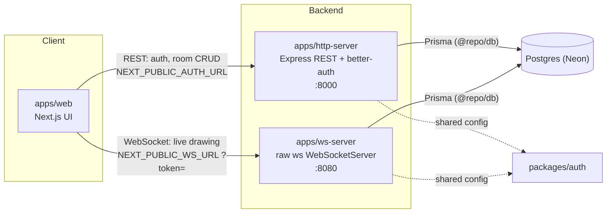

# Architecture

Vexio is a **Turborepo monorepo** managed with **bun workspaces**: three runnable apps, plus shared packages.

## Apps and packages

| Path | What it is | Port |
|---|---|---|
| `apps/web` | Next.js 16 (App Router) / React 19 — the whiteboard UI | 3001 |
| `apps/http-server` | Express 5 on Bun — REST API + better-auth mount | 8000 |
| `apps/ws-server` | Raw `ws` WebSocketServer on Bun — real-time whiteboard sync | 8080 |
| `packages/db` | Prisma 7 client (`@prisma/adapter-neon`), models, service functions | — |
| `packages/auth` | better-auth server config, shared by http-server & ws-server | — |
| `packages/common` | `ApiError` / `ApiResponse` helpers, `loadRootEnv()` | — |
| `packages/ui` | Unmodified `create-turbo` starter stub — **not** used for real UI (see `apps/web/components/`) | — |

## System diagram

`apps/web` talks to the backend over two independent, env-configured channels:
- `NEXT_PUBLIC_AUTH_URL` → REST calls to `apps/http-server` (auth + room CRUD)
- `NEXT_PUBLIC_WS_URL` → the live socket to `apps/ws-server`

Both backend processes import `packages/auth` (to verify sessions/tokens) and `packages/db` (to read/write Postgres) — there's no service-to-service HTTP call between `http-server` and `ws-server`; they're independent processes that share the same database and auth config.

## Tech stack

| Layer | Technology |
|---|---|
| Package manager / runtime | bun 1.3.4 |
| Monorepo tooling | Turborepo |
| Frontend framework | Next.js 16 (App Router), React 19 |
| Styling | Tailwind CSS |
| REST API | Express 5, running under Bun |
| Real-time | raw `ws` (WebSocket), no framework |
| Auth | better-auth (email/password + Google/GitHub OAuth, bearer-token plugin) |
| Database | PostgreSQL via Neon (serverless), Prisma 7 + `@prisma/adapter-neon` |
| Email | nodemailer over SMTP |
| Language | TypeScript throughout |

See [03-getting-started.md](./03-getting-started.md) to run it locally.
