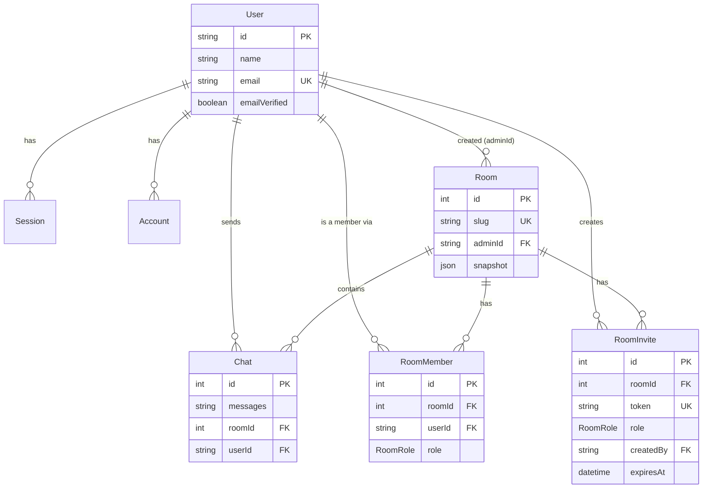

# Data Model

Schema source: `packages/db/prisma/schema.prisma`. Postgres via Neon, Prisma 7.

## Models

### User

| Field | Type | Meaning |
|---|---|---|
| `id` | String (PK) | User id |
| `name` | String | Display name (used for live cursor labels) |
| `email` | String (unique) | Login email |
| `emailVerified` | Boolean | Whether the email is verified (default `false`) |
| `image` | String? | Avatar URL |
| `createdAt` / `updatedAt` | DateTime | Timestamps |

### Session (better-auth)

| Field | Type | Meaning |
|---|---|---|
| `id` | String (PK) | Session id |
| `expiresAt` | DateTime | Expiry |
| `token` | String (unique) | Session token |
| `ipAddress` / `userAgent` | String? | Client metadata |
| `userId` | String (FK → User) | Owner |

### Account (better-auth)

| Field | Type | Meaning |
|---|---|---|
| `id` | String (PK) | Account id |
| `accountId` | String | Provider-side account id |
| `providerId` | String | e.g. `google`, `github`, `credential` |
| `userId` | String (FK → User) | Owner |
| `accessToken` / `refreshToken` / `idToken` | String? | OAuth tokens |
| `accessTokenExpiresAt` / `refreshTokenExpiresAt` | DateTime? | Token expiry |
| `scope` | String? | OAuth scope |
| `password` | String? | Hashed password (email/password accounts) |

### Verification (better-auth)

| Field | Type | Meaning |
|---|---|---|
| `id` | String (PK) | Verification id |
| `identifier` | String | What's being verified (e.g. email) |
| `value` | String | Verification token/value |
| `expiresAt` | DateTime | Expiry |

### Room

| Field | Type | Meaning |
|---|---|---|
| `id` | Int (PK) | Room id |
| `slug` | String (unique) | URL-safe room identifier (`a-z0-9-`, 3–64 chars) |
| `createdAt` | DateTime | Timestamp |
| `adminId` | String (FK → User) | Creator. Kept for provenance, but access control is now driven by `RoomMember`, not this field alone. |
| `snapshot` | Json? | Persisted whiteboard elements array |

### RoomMember

Join table between `User` and `Room` — this **is** the access-control model. `createRoom` creates the room's `RoomMember` row (role `ADMIN`) for the creator in the same transaction.

| Field | Type | Meaning |
|---|---|---|
| `id` | Int (PK) | Membership row id |
| `roomId` | Int (FK → Room, cascade delete) | Which room |
| `userId` | String (FK → User, cascade delete) | Which user |
| `role` | `RoomRole` | `ADMIN`, `EDITOR`, or `VIEWER` (default `EDITOR`) |
| `createdAt` | DateTime | Timestamp |

`@@unique([roomId, userId])` — one membership per user per room.

### RoomInvite

A single-use-per-accept, token-based invite that grants a role on a room. Consuming an invite upserts a `RoomMember` row for the accepting user.

| Field | Type | Meaning |
|---|---|---|
| `id` | Int (PK) | Invite id |
| `roomId` | Int (FK → Room, cascade delete) | Room being invited to |
| `token` | String (unique) | Opaque invite token (`crypto.randomUUID()`), embedded in the invite URL |
| `role` | `RoomRole` | Role granted on accept (default `EDITOR`; only `EDITOR`/`VIEWER` may be issued via the API) |
| `createdBy` | String (FK → User, cascade delete) | Admin who created the invite |
| `expiresAt` | DateTime? | Optional expiry; `null` means it never expires |
| `createdAt` | DateTime | Timestamp |

### RoomRole (enum)

`ADMIN` — full control (rename/delete room, manage members, create invites). `EDITOR` — can edit the whiteboard. `VIEWER` — read-only. Every room must keep at least one `ADMIN`; the API blocks demoting, removing, or self-leaving the last admin (see [05-http-api.md](./05-http-api.md)).

### Chat (model + service exist, **not wired up to HTTP/WS yet** — see [07-roadmap.md](./07-roadmap.md))

| Field | Type | Meaning |
|---|---|---|
| `id` | Int (PK) | Chat message id |
| `messages` | String | Message content |
| `roomId` | Int (FK → Room, **onDelete: Cascade**) | Which room — deleting a room now also deletes its chats |
| `userId` | String (FK → User) | Who sent it |

Service functions exist (`packages/db/src/services/chat.ts`: create/get/update/delete), but no HTTP route or WebSocket message type calls them yet. Slated to be wired up alongside the WebSocket work in [docs/guides/WEBSOCKET_IMPLEMENTATION.md](./guides/WEBSOCKET_IMPLEMENTATION.md).

## ER diagram

